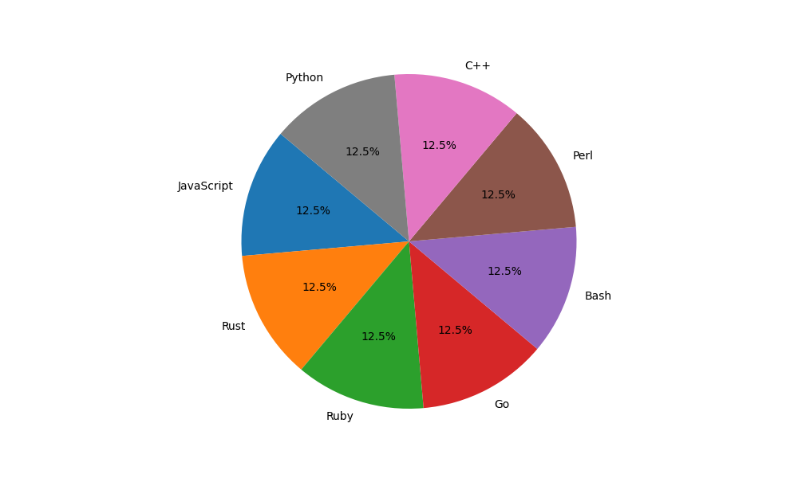

# Brainfuck Interpreters

 

## What is this and why?
Learning new programming languages can be difficult. One way that helps me is to write a bunch of different programs (or rewrite old stuff from other languages) as a way to get more practice using the various parts of the language. It helps to have something I'm familiar with, but also has enough challenge where I can really dig into the strengths or inconveniences of a given language.

A Brainfuck interpreter is - for me - a great program to write as it includes enough pitfalls that you can easily get stuck, but is also simple enough that you can do it in a couple of hours, worst case.

  

## Wait, what is Brainfuck?
Brainfuck is a Turing-complete, esoteric language created by Urban Müller in 1993. Building off of Corrado Böhm's `P''` ("P double-prime") language, Brainfuck allows for easy input/output with the operators `,` and `.` respectively. Feel free to read more about Brainfuck [here](https://esolangs.org/wiki/Brainfuck)

  

## Languages so far
<!-- pie-chart-start -->

<!-- pie-chart-end -->

## Upcoming languages
- C
- PHP
- Lua
- Haskell
- COBOL
- FORTRAN
- Assembly

## Interesting things I learned about each language

- Python
  - todo
- Rust
  - todo
- JavaScript
  - todo
- Ruby
  - todo
- Go
  - The whole concept of "runes"
  - When reading data from a file it will give you the data how it is represented in memory. So reading "AAA" from a file and iterating over it will yield "656565". Meaning you often have to convert things between strings, runes, etc
- Bash
  - Bash has always been a fun, cryptic, and wizardly experience when writing it. So I always like trying weird stuff like this to learn new tricks.
  - Arithmetic Comparison (i.e. the (()) syntax to do stuff like (( thing < 69 ))) always trips me up and I often forget about it

## General process for each language
Here is a list of things that you have to do to create an interpreter for Brainfuck. This also doubles as a list of all the things you end up learning for every new language

- Read file contents into a variable (usually a string, but sometimes a byte array. Really just anything that is indexed and you can iterate over)
- Declare an indexed array of a fixed size
- Declare an indexed array of variable size
- Start a WHILE loop
- Get length of a string
- SWITCH statement (or MATCH, or an IF/ELSE ladder, etc)
- Change value in array
- Append value to the end of an array
- Remove value from the end of an array
- Get value at the end of an array (You'd be surprised how many languages do not support negative array indexing)
- Keyboard input
- Converting input (often a string) into the decimal representation for that given ASCII value (e.g. A -> 65)
- Converting decimal to ASCII for printing (e.g. 65 -> A)
- Printing to the console
- Does the language have a simple +=1 syntax, or do you have to do the long version?
- Does the language have a simple NOT operator like `!` or `not`? (This is why I do `if !loop` at the bottom of my WHILE loops rather than switch the logic and do `if loop`)
- 